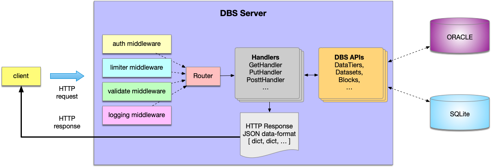

### DBS Server
The DBS Server consists of several components:

- [DBS Reader](DBSReader.md) which provides DBS read APIs
- [DBS Writer](DBSWriter.md) which handles DBS write APIs and writes data to underlying DBS DB
- [DBS Migration server](MigrationServer.md)

Each server can be run via `dbs2go` executable with appropriate configuration
file, e.g.

```
# to start DBS Reader server
./dbs2go -config dbs-reader.json
```
Please refer to `Configuration` struct located in `web/config.go` file for more
details of each DBS server configuration option.

Here is architecture of the DBS server:


### Repository structure and code logic
[dbs2go](https://github.com/vkuznet/dbs2go) has the following structure:
- [dbs](https://github.com/vkuznet/dbs2go/tree/master/dbs)
  folder contains all business and DAO objects
- [static](https://github.com/vkuznet/dbs2go/tree/master/static) area contains 
  - [SQL templates](https://github.com/vkuznet/dbs2go/tree/master/static/sql)
  - [HTTP templates](https://github.com/vkuznet/dbs2go/tree/master/static/templates)
  - [CSS](https://github.com/vkuznet/dbs2go/tree/master/static/css)
  - [DB schemas](https://github.com/vkuznet/dbs2go/tree/master/static/schema)
  - [images](https://github.com/vkuznet/dbs2go/tree/master/static/images)
  - [lexicon.json](https://github.com/vkuznet/dbs2go/blob/master/static/lexicon.json)
  to store regular expression for validating input parameters
- [web](https://github.com/vkuznet/dbs2go/tree/master/web) contains all
  codebase related to HTTP web server, including handlers, middleware
  implementaions, etc.
- [utils](https://github.com/vkuznet/dbs2go/tree/master/utils) contains general
  utilities used across the codebase
- [graphql](https://github.com/vkuznet/dbs2go/tree/master/graphql) contains
  initial implementation of [GraphQL](https://graphql.org/) for DBS server.

The HTTP server consists of the following components:
- [server.go](https://github.com/vkuznet/dbs2go/blob/master/web/server.go)
  implements server logic
- [handlers.go](https://github.com/vkuznet/dbs2go/blob/master/web/handlers.go)
  contains all HTTP handlers
- [middleware.go](https://github.com/vkuznet/dbs2go/blob/master/web/middleware.go)
  contains all midlewares layers
- [metrics.go](https://github.com/vkuznet/dbs2go/blob/master/web/templates.go)
  contains implementation of DBS metrics which can be used by
  [Prometheus](https://prometheus.io/)
- [templates.go](https://github.com/vkuznet/dbs2go/blob/master/web/templates.go)
  holds implementation of DBS templates

The HTTP server relies on the following logic:
- get HTTP request and route it to appropriate handler
- handler either calls DBSGetHandler or DBSPostHandler
- the DBSXXXHandler takes api name and route it to DBS API
- the individual DBS API perform validation of input parameters
- check that provided set of parameters consists with required attributes
- and implements appropriate logic of the API, e.g. queyr DBS DB for requested
- information

### DBS business and DAO logic
The DBS business and DAO logic resides within
[dbs](https://github.com/vkuznet/dbs2go/blob/master/dbs) folder.
The individual file, e.g.
[tiers.go](https://github.com/vkuznet/dbs2go/blob/master/dbs/tiers.go)
holds full implemenation for that specific api `/tiers` used by DBS server.
It includes corresponding data strcut, e.g. `DataTiers`, which represent associative
DBS table. Each DBS API implements `DBRecord` interface (found in
[dbs/dbs.go](https://github.com/vkuznet/dbs2go/blob/master/dbs/dbs.go)):
```
type DBRecord interface {
	Insert(tx *sql.Tx) error
	Validate() error
	SetDefaults()
	Decode(r io.Reader) error
}
```
The `DBRecord` can be inserted to DB via `Insert` API, it can be
validated via `Validatae` method, it can implement defaults via
`SetDefaults` method and can be decoded via `Decode` API. Therefore,
the `/tiers` DBS API, representing by `dbs/tiers.go` codebase contains
`DataTiers` struct which implements the above interface for `DataTiers`
table, i.e. it allows to insert, validate, set defaults and decode
records representing `DataTiers` data.

The look-up API, e.g. `/datatiers`, fetches data from corresponding DB table.
The workflow is the following:
- prepare SQL statement based on provided set of parameters
  - you may find individual SQL templates in
    [static/sql](https://github.com/dmwm/dbs2go/tree/master/static/sql) area,
    e.g. data tiers SQL can be found
    [here](https://github.com/dmwm/dbs2go/blob/master/static/sql/tiers.sql),
    while SQL statement associated with insertion is located
    [here](https://github.com/dmwm/dbs2go/blob/master/static/sql/insert_tiers.sql)
- validate and compose binding variables for SQL query
- pass individual SQL statment along with its binding parameters to execute API
  - there are two set of APIs:
  `executeAll` and `execute`
  presented in [dbs/dbs.go](https://github.com/dmwm/dbs2go/blob/master/dbs/dbs.go)
  module. The former takes prepared SQL statement along with binding
  arguments, while later takes in addition explicit set of columns to fetch.
  Both APIs place request to underlying DB and write results directly
  to provided writer (e.g. HTTP response). This architecture allows to
  keep memory usage at minimum and scale regardless of number of fetch rows.
  The results are streamed back to the client.

### DBS errors
The DBS code provides standard set of erros and corresponding error codes.
They are located in `dbs/errors.go`:
```
        GenericErrorCode        = iota + 100 // generic DBS error
        DatabaseErrorCode                    // 101 database error
        TransactionErrorCode                 // 102 transaction error
        QueryErrorCode                       // 103 query error
        RowsScanErrorCode                    // 104 row scan error
        SessionErrorCode                     // 105 db session error
        CommitErrorCode                      // 106 db commit error
        ParseErrorCode                       // 107 parser error
        LoadErrorCode                        // 108 loading error, e.g. load template
        GetIDErrorCode                       // 109 get id db error
        InsertErrorCode                      // 110 db insert error
        UpdateErrorCode                      // 111 update error
        LastInsertErrorCode                  // 112 db last insert error
        ValidateErrorCode                    // 113 validation error
        PatternErrorCode                     // 114 pattern error
        DecodeErrorCode                      // 115 decode error
        EncodeErrorCode                      // 116 encode error
        ContentTypeErrorCode                 // 117 content type error
        ParametersErrorCode                  // 118 parameters error
        NotImplementedApiCode                // 119 not implemented API error
        ReaderErrorCode                      // 120 io reader error
        WriterErrorCode                      // 121 io writer error
        UnmarshalErrorCode                   // 122 json unmarshal error
        MarshalErrorCode                     // 123 marshal error
        HttpRequestErrorCode                 // 124 HTTP request error
        MigrationErrorCode                   // 125 Migration error
        RemoveErrorCode                      // 126 remove error
        InvalidRequestErrorCode              // 127 invalid request error
```
The DBS web handler wraps each DBS error in HTTP failure request with two
common structures: `HTTPError` and `DBSError` which are part of `ServerError`
```
// HTTPError represents HTTP error structure
type HTTPError struct {
        Method         string `json:"method"`           // HTTP method
        HTTPCode       int    `json:"code"`             // HTTP status code from IANA
        Timestamp      string `json:"timestamp"`        // timestamp of the error
        Path           string `json:"path"`             // URL path
        UserAgent      string `json:"user_agent"`       // http user-agent field
        XForwardedHost string `json:"x_forwarded_host"` // http.Request X-Forwarded-Host
        XForwardedFor  string `json:"x_forwarded_for"`  // http.Request X-Forwarded-For
        RemoteAddr     string `json:"remote_addr"`      // http.Request remote address
}

// ServerError represents HTTP server error structure
type ServerError struct {
        DBSError  error     `json:"error"`     // DBS error
        HTTPError HTTPError `json:"http"`      // HTTP section of the error
        Exception int       `json:"exception"` // for compatibility with Python server
        Type      string    `json:"type"`      // for compatibility with Python server
        Message   string    `json:"message"`   // for compatibility with Python server
}
```

On a client side a particular error will look like this:

```
curl .. http://.../dbs2go/datatiers?data_tier_name=1

[
  {
    "error": {
      "reason": "DBSError Code:114 Description:DBS validation error when wrong pattern is provided Function:dbs.validator.Check Message:unable to match 'data_tier_name' value '1' Error: invalid parameter(s)",
      "message": "not str type",
      "function": "dbs.Validate",
      "code": 113
    },
    "http": {
      "method": "GET",
      "code": 400,
      "timestamp": "2022-02-04 14:47:47.058650325 +0000 UTC m=+86568.954530362",
      "path": "/dbs2go/datatiers?data_tier_name=1",
      "user_agent": "curl/7.59.0",
      "x_forwarded_host": "cmsweb-testbed.cern.ch",
      "x_forwarded_for": "188.185.79.81",
      "remote_addr": "188.184.75.219:20274"
    },
    "exception": 400,
    "type": "HTTPError",
    "message": "DBSError Code:113 Description:DBS validation error, e.g. input parameter does not match lexicon rules Function:dbs.Validate Message:not str type Error: nested DBSError Code:114 Description:DBS validation error when wrong pattern is provided Function:dbs.validator.Check Message:unable to match 'data_tier_name' value '1' Error: invalid parameter(s)"
  }
]
```

The returned HTTP response contains all relevant information to identify DBS
error, its code, and user client info (such as host, user-agent, etc).

Each DBSError may be wrapped into another one to provide relevant information
how error was originated (similar to Python traceback).
