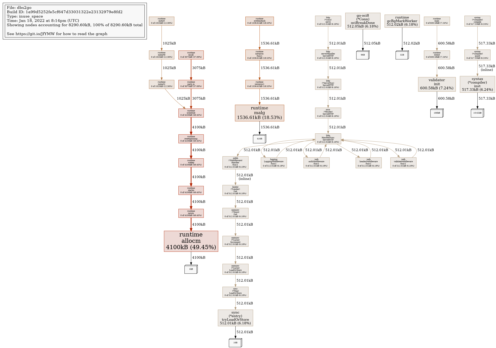

### Debugging DBS Go server
For easy debugging please use `curl` with verbose flag and your favorite
DBS server API. For instance, to check `datatiers` you may call
```
curl -v -L -k --key ~/.globus/userkey.pem --cert ~/.globus/usercert.pem \
    https://xxx.cern.ch/dbs/int/global/DBSReader/datatiers
```
For other APIs, please consult [DBS APIs](apis.md) information.

### Profiling DBS Go server
The Go language provides excellent profile tool called
[pprof](https://go.dev/blog/pprof)
which allows to get a snapshot of running Go server. It is enabled by default
in DBS Go server. To run it you need a go compiler itself which can access
your DBS Go server.

For instance, if you run your DBS Go server on localhost, then you can access
its profile information via:
```
# to access heap info
go tool pprof http://localhost:port/debug/pprof/heap

# to access block information
go tool pprof http://localhost:port/debug/pprof/block

# to access profile information
go tool pprof http://localhost:port/debug/pprof/profile

# to access mutex information
go tool pprof http://localhost:port/debug/pprof/mutex
```
Then, you'll be given `pprof` prompt and can explore its commands via
`help`. For example, if you want to see 10 top most busy functions you'll do
```
go tool pprof http://localhost:port/debug/pprof/heap
...
(pprof) top
Showing nodes accounting for 4703.47kB, 100% of 4703.47kB total
Showing top 10 nodes out of 33
      flat  flat%   sum%        cum   cum%
 1025.12kB 21.80% 21.80%  1025.12kB 21.80%  runtime.allocm
  600.58kB 12.77% 34.56%  1114.59kB 23.70%  github.com/go-playground/validator/v10.init
  514.63kB 10.94% 45.51%   514.63kB 10.94%  html/template.init
     514kB 10.93% 56.43%      514kB 10.93%  regexp.mergeRuneSets.func2 (inline)
  512.56kB 10.90% 67.33%   512.56kB 10.90%  regexp.onePassCopy
  512.31kB 10.89% 78.22%   512.31kB 10.89%  regexp/syntax.(*compiler).inst (inline)
  512.20kB 10.89% 89.11%   512.20kB 10.89%  runtime.malg
  512.05kB 10.89%   100%   512.05kB 10.89%  context.(*cancelCtx).Done
         0     0%   100%   512.05kB 10.89%  database/sql.(*DB).connectionOpener
         0     0%   100%  1024.88kB 21.79%  github.com/go-playground/validator/v10.init.0
```

#### Accessing pprof info on k8s
In order to access `pprof` tool on k8s infrastructure you need to deploy
an image with `go` tool in it, e.g. you may used `golang` image. Then, you may
start `pprof` by calling your DBS Go server in appropriate namespace. On CMSWEB
we deploy DBS server within DBS namespace and therefore can access it via the
following command
```
# step 1: deploy go based image
# step 2: login into go based image via
kubectl -n dbs exec -ti <dbs2g-global-r-pod> -- /bin/bash

# step 3: within your go based image pod shell you may
# access pprof for dbs2go-global-r service on port XXXX
$ go tool pprof http://dbs2go-global-r.dbs:XXXX/debug/pprof/heap
```

#### Generating profiling graphs
With `pprof` you may generate Go server graphs like this:
```
# to generate plots you need dot tool which comes from Graphiz
# install Graphiz on Debian based system (if it is not installed in your image):
apt-get install graphviz

# generate profile graph (replace XXXX with appropriate port number)
go tool pprof -png http://dbs2go-global-r.dbs:XXXX/debug/pprof/profile > profile.png

# generate heap graph
go tool pprof -png http://dbs2go-global-r.dbs:XXXX/debug/pprof/heap > heap.png
```
Below you can see both heap and profile graphs generated for cmsweb testbed DBS
server.

#### DBS heap graph


#### DBS profile graph


#### DBS Flame graph
```
# install go-torch
go install github.com/uber/go-torch@latest

# install flamegraph
git clone --depth 1 https://github.com/brendangregg/FlameGraph
export PATH=$PATH:$PWD/FlameGraph

# run go-torch to generate FlameGraph (replace XXXX with concrete port number):
# CPU graph
go-torch -u http://dbs2go-global-r.dbs:XXXX --seconds 10

# memory graph
go-torch http://dbs2go-global-r.dbs:XXXX/debug/pprof/heap --seconds 120 --colors mem -f mem.svg

# it will produce torch.svg FlameGraph file which you can view
# or convert into another graphics format
```
