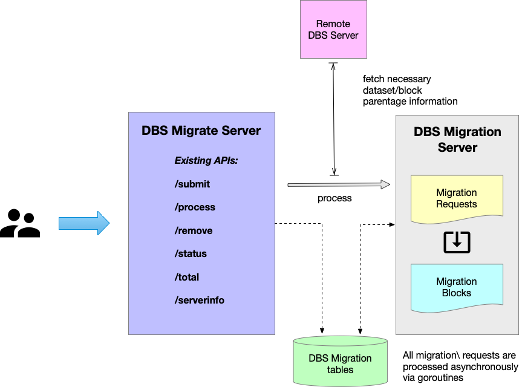

### DBS Migration Server

The architecture of DBS Migrate and DBS Migration servers can be found in the
following diagram:



The DBS migration servers has the following responsibility:
- *DBS migrate* server is HTTP service which access end-user request
to submit and check status of migration requests. It has the following set
of APIs:
  - `/submit` submits migration (HTTP POST) request
  - `/process` explicitly performs processing given migration request (since
    DBSMigration service process migration requests sequentially)
  - `/cancel` cancels existing migration requests, i.e. it will be terminated
    and moved to status 9
  - `/remove` removes migration request
  - `/status` fetches status of given migraton request
  - `/total` shows total number of migration requests in a system
  - `/apis` provides information about existing APIs provided by this server
  - `/healthz` provides health status of DBS server, each server implements
  different query (e.g. DBS reader/writer uses datasetaccesstypes API,
  while migration server look-up number of records in migraton block table)
  - `/serverinfo` provides server information
- *DBS migration* server runs as a daemon to process migraton requests
from underlying DB backend on periodic basis
- by default the number of retries for migration request is set to 3 and it is
  configurable parameter for DBSMigration server.
- here is a full set of migration codes used by migration server:
  - 0 pending request
  - 1 migration request is in progress
  - 2 migration request has successfully completed
  - 3 migration request has failed
  - 9 migration request termindated
  Usually, the migration request goes throught the followin cycle:
```
status change:
0 -> 1
1 -> 2
1 -> 3
1 -> 9
are only allowed changes for working through migration.
3 -> 1 is allowed for retrying and retry count +1.
```

### Examples
Post migration request:
- please note that in all section below I used
  `http://localhost:9898/dbs2go-migrate` URL for DBSMigrate server and it
  should be replaced with `https://cmsweb.cern.ch/dbs/prod/global/DBSMigrate`
  or `https://cmsweb-testbed.cern.ch/dbs/int/global/DBSMigrate` or
  corresponding `phys03` URLs
```
# migration document
cat > m.json << EOF
{
    "migration_url": "https://.../dbs/prod/global/DBSReader",
    "migraton_input": "/a/b/c#123"
}
EOF

# submit migration request
curl -H "Content-Type: application/json" -d@$PWD/m.json \
    http://localhost:9898/dbs2go-migrate/submit
```

Process migration request
```
# migration document
cat > m.json << EOF
{
    "migration_rqst_id":65023
}
EOF

# submit migration request
curl -H "Content-Type: application/json" -d@$PWD/m.json \
    http://localhost:9898/dbs2go-migrate/process
```

Fetch status of migration request
```
curl http://localhost:9898/dbs2go-migrate/status

[
{"create_by":"giffels","creation_date":1391014486,"last_modification_date":1391014924,"last_modified_by":"giffels","migration_input":"/GluGluToHToWWTo2LAndTau2Nu_M-90_7TeV-powheg-pythia6/Fall11-PU_S6_START42_V14B-v1/AODSIM","migration_request_id":5002,"migration_status":3,"migration_url":"https://cmsweb.cern.ch/dbs/prod/global/DBSReader","retry_count":3}
,{"create_by":"giffels","creation_date":1391014486,"last_modification_date":1391014949,"last_modified_by":"giffels","migration_input":"/ZZTo2e2mu_8TeV_mll8_mZZ95-160-powheg15-pythia6/Summer12_DR53X-PU_S10_START53_V19-v1/AODSIM","migration_request_id":10001,"migration_status":3,"migration_url":"https://cmsweb.cern.ch/dbs/prod/global/DBSReader","retry_count":3}
,{"create_by":"giffels","creation_date":1391014499,"last_modification_date":1391014965,"last_modified_by":"giffels","migration_input":"/CIToMuMu_Con_Lambda-19_M-800_TuneZ2star_8TeV-pythia6/Summer12_DR53X-PU_S10_START53_V19E-v1/AODSIM","migration_request_id":5004,"migration_status":3,"migration_url":"https://cmsweb.cern.ch/dbs/prod/global/DBSReader","retry_count":3}
...

# or you can fetch status info of single request
curl http://localhost:9898/dbs2go-migrate/status?migration_request_id=10005
[
{"create_by":"giffels","creation_date":1391014552,"last_modification_date":1391015023,"last_modified_by":"giffels","migration_input":"/ZJetToEE_Pt-170to230_TuneEE3C_8TeV_herwigpp/Summer12_DR53X-PU_S10_START53_V19-v1/AODSIM","migration_request_id":10005,"migration_status":3,"migration_url":"https://cmsweb.cern.ch/dbs/prod/global/DBSReader","retry_count":3}
]
```

Get total number of migraton requests in a system:
```
curl http://localhost:9898/dbs2go-migrate/total
[
{"count":2319}
]
```
Remove migraton request from a system:
```
curl -v -H "Content-type: application/json" \
    -d@$PWD/mig_request.json \
    http://localhost:9898/dbs2go-migrate/remove

[{"api":"remove","error":"Invalid request. Successfully processed or processing requests cannot be removed, or the requested migration did not exist, or the requestor for removing and creating has to be the same user.","exception":400,"method":"POST","type":"HTTPError"}]
```
